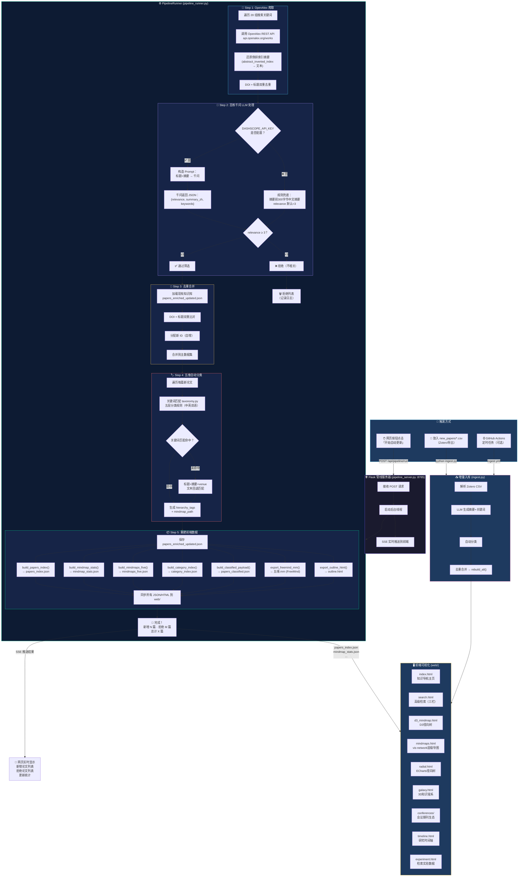
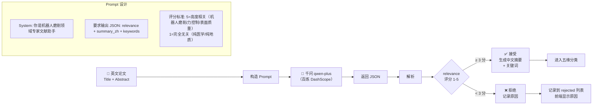
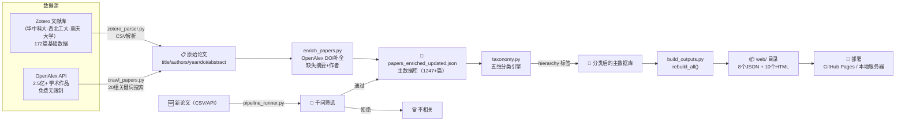

# 机器人柔性磨削知识库 — 全流程自动更新管线

> 从数据采集到前端可视化的完整自动化管线 · 2025年6月

---

## 一、总览流程图



---

## 二、LLM 决策逻辑详解



---

## 三、数据流全景



---

## 四、文件对应关系

| 管线步骤 | Python 脚本 | 输入 | 输出 |
|---------|------------|------|------|
| Zotero解析 | `scripts/zotero_parser.py` | `new_papers/*.csv` | 论文字典列表 |
| OpenAlex爬取 | `scripts/crawl_papers.py` | API查询 | `newly_crawled.json` |
| 元数据补全 | `scripts/enrich_papers.py` | DOI → OpenAlex | 补全的摘要/作者/年份 |
| LLM摘要+筛选 | `scripts/bailian_client.py` | 标题+摘要 → 千问 | summary_zh + keywords + relevance |
| 五维分类 | `scripts/taxonomy.py` | 论文关键词/文本 | hierarchy 五层标签 |
| 重建前端数据 | `scripts/build_outputs.py` | 主JSON | 8个前端数据文件 |
| 一键重建 | `scripts/rebuild_all.py` | 主JSON | 全部输出 + 同步到 web/ |
| **全自动管线** | **`scripts/pipeline_runner.py`** | OpenAlex API | 全流程 + 进度事件 |
| **Web 服务器** | **`pipeline_server.py`** | HTTP请求 | SSE流 + 静态文件 |
| 增量入库 | `ingest.py` | new_papers/*.csv | 更新主JSON + 重建 |

---

## 五、启动方式

```bash
# 1. 安装依赖
pip install -r requirements.txt

# 2. 设置百炼 API Key（可选，不设则用规则兜底）
set DASHSCOPE_API_KEY=sk-your-key-here

# 3. 启动管线服务器
py -3 pipeline_server.py

# 4. 打开浏览器
# http://localhost:8765
# 滚动到页面底部 → 点击「🚀 开始自动更新」

# 5. 或者命令行直接运行管线
py -3 -m scripts.pipeline_runner
```
